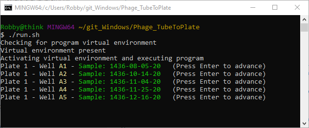
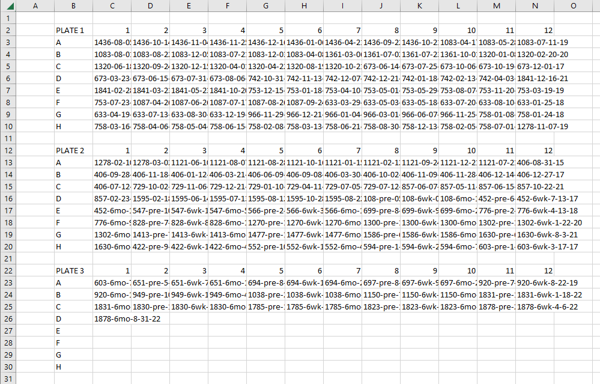

# MasterPlateMaker

## What is MasterPlateMaker?
MasterPlateMaker is a basic Python 3 utility to help members of the DeRisi lab make master plates of precious samples that arrived in tubes with the use of a CSV file. The utility provided here automates the process of identifying a new well/sample pair to reduce time and error. It works with Linux and macOS terminals and Git Bash on Windows.


## Why use MasterPlateMaker?
Plating samples from tubes is a long, manual process, which makes it error prone. Once a master plate CSV is planned out, the scientist will:
1. Check to see what sample is listed in well A1 of plate 1
2. Check to see if that sample they're holding is correct
3. Plate the sample
4. Move to a new row/column for the next sample
5. Repeat this process more than 200 times!

Highlighting the next cell with arrow keys takes extra time, risks contamination, and can be forgotten or done incorrectly if you start to lose focus.

If this utility is regularly used and is well received, improvements can be made to reduce risk of contamination - such as building and employing hardware for hands-free use.

## How does it work?

There are three components: a configuration file, a bash script, and a CSV file for the master plate.

### Configuration file
The configuration file is pretty simple and can be found at [**config.ini**](config.ini).

**Sections**
* *FILE_NAME* : If you use different file names, update the entry in this section to match the file of interest.
* *PROGRAM_FORMAT* : You can specify the color of text that is output to the terminal and if the terminal is cleared so that only one well/sample is displayed at a time.
* *FILE_FORMAT* : This section is used to identify key locations, including the cell that says "PLATE1", the rows between the text "PLATE1" and "PLATE2", or the 1st sample in well "A1". If you are using the CSV provided in this repo as a template, none of these settings need to be changed.
* *RESUME* : The program will terminate when it finds an empty cell. If you accidentally left a cell empty, you can tell the program where to start from the next time you run it.

### Bash script
All you need to do is type `./run.sh` with a terminal that has admin privledges. The script will:
1. Create a virtual environment if one doesn't exist already
2. Install the required packages for a new virtual environment
3. Activate the environment
4. Run the program
5. Deactivate the environment when finished

This improves the portability of this utility.



### CSV
The program relies on a CSV to know what sample to present to the user. A template can be found at [**masterplate.csv**](masterplate.csv), but you can make your own as long as the word "PLATE" is present near the first sample of every plate and the samples are arranged as a rectangle without empty cells between samples on the same plate. If you have an empty cell, it is best to fill it with dummy text like "X" or "EMPTY".



## How to get started
1. Clone or download the repository
2. Change the config file to match your interests
3. Add your CSV file to the folder or edit the template included
4. Navigate to the directory with a terminal that has admin privledges
5. Run the following command:
```bash
./run.sh
```

## How to remove the program
1. Delete the folder containing the program files

## Dependencies
* Python 3
* Python 3 Module : venv
* Python 3 Module : pip
* Terminal with Bash